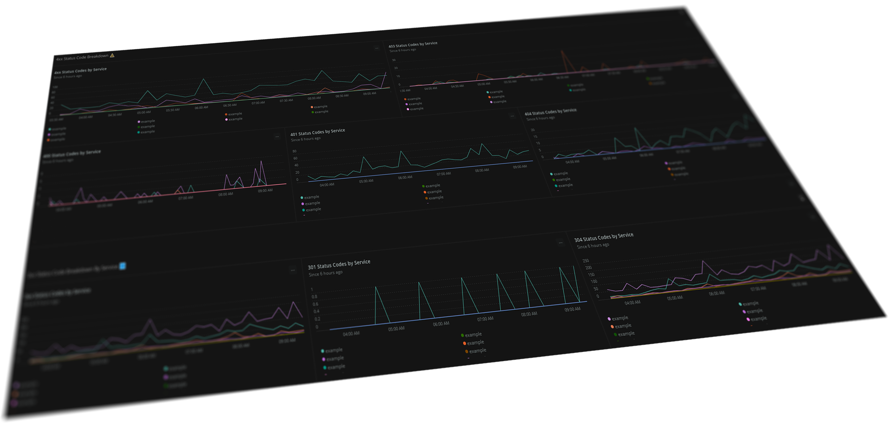
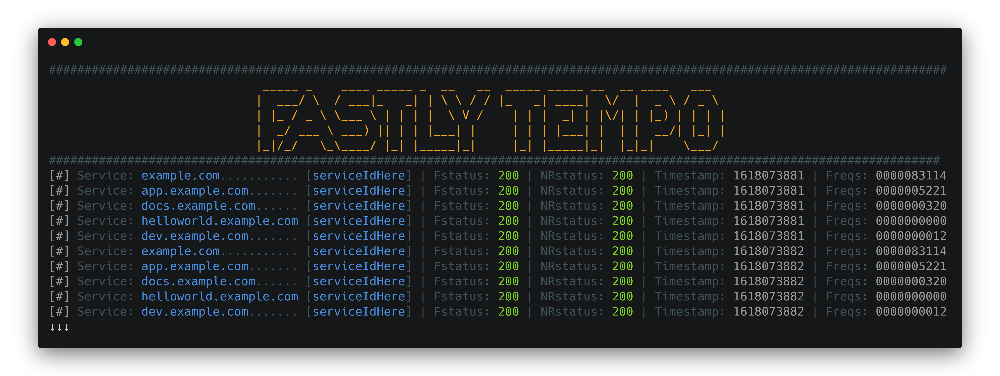
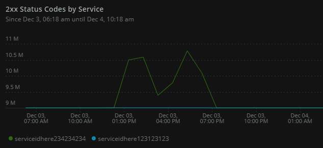
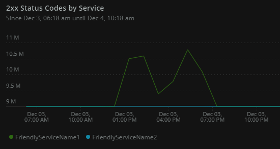
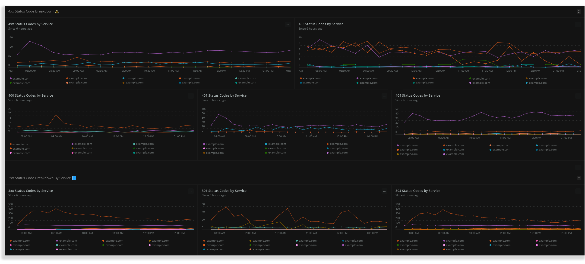
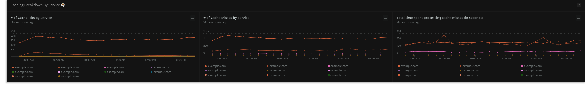
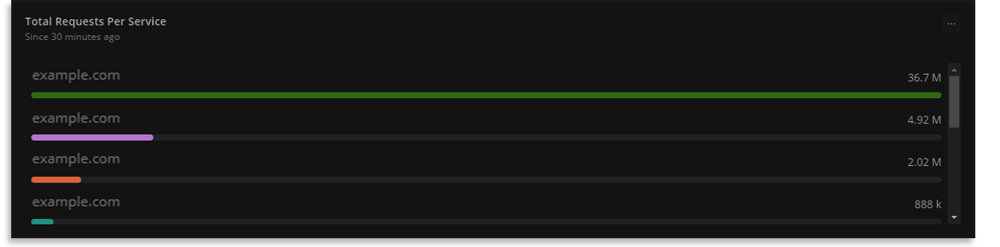
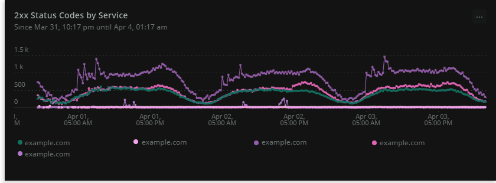

# Fastly Tempo 🚀

[](https://github.com/grantbirki/fastly-tempo/actions) [](https://github.com/grantbirki/fastly-tempo/actions) [](https://github.com/grantbirki/fastly-tempo/actions) [](https://github.com/grantbirki/fastly-tempo/actions)

Monitor, Alert, and Display all your Fastly Metrics in Real-Time!

This is based off the New Relic blessed way to get your Fastly metrics into New Relic Insights, packaged as a Docker container image for ease of use!

In order to use the Fastly Tempo Docker image, you will need an active New Relic account with Insights, an active Fastly account with Read access, a New Relic Insights Insert key and a Fastly API Key.

## Dashboard 🗺️

Here is an example of a 4xx alert dashboard that can be created in New Relic from the `Fastly Tempo` container:

<!-- markdownlint-disable no-inline-html -->
<p align="center">
  
</p>
<!-- markdownlint-enable no-inline-html -->

<!-- markdownlint-disable no-inline-html -->
<p align="center">
  
</p>
<!-- markdownlint-enable no-inline-html -->

## Supported Backends 🧰

Currently, there is only one support backend to send metrics to: `New Relic`

However, there are plans to integrate with other providers/backends in the future for greater integrations.

* New Relic: Supported ✔️
* Datadog: Planned
* Prometheus: Planned
* Graphite: Planned
* Splunk: Planned

## Quick Start ⭐

Grab the image from [DockerHub](https://hub.docker.com/r/grantbirki/fastly-tempo) 🐳

### Using Docker-Compose (Preferred)

Using Docker-Compose to run this image is extremely easy.

1. Create a file named `creds.env` at the root of this repo with the following contents:

    ```ini
    ACCOUNT_ID=#######
    INSERT_KEY=XXXXXXXXXXXXXX
    FASTLY_KEY=XXXXXXXXXXXXXXXXXXXXXXXXXXX
    ```

2. Add your services to `config.env`

    ```ini
    ...
    SERVICES=ServiceName1:ServiceId1 ServiceName2:ServiceId2 ...
    ```

3. Run: `make run`

4. ✔️ Log into New Relic and view your logs!

### Using Docker

1. Build: `docker build -t fastly-tempo .`
2. Run:

    ```bash
    docker run \
      -e ACCOUNT_ID='yourNewRelicAccountId' \
      -e FASTLY_KEY='yourFastlyKey' \
      -e INSERT_KEY='yourNewRelicInsertKey' \
      -e SERVICES='ServiceId1 ServiceId2 ...' \
      fastly-tempo
    ```

## How to use this image 📚

Before you get started, make sure that you have a [Fastly API Key](https://docs.fastly.com/guides/account-management-and-security/using-api-tokens) and a [New Relic Insert Key](https://docs.newrelic.com/docs/insights/insights-data-sources/custom-data/insert-custom-events-insights-api#register).

The Fastly Tempo image is configured by environment variables.

These are required:

* `ACCOUNT_ID`
* `FASTLY_KEY`
* `INSERT_KEY`
* `SERVICES`

These are optional:

* `SILENT` - Print output True/False. Default: `False`
* `INTERVAL` - Interval in seconds to poll data from Fastly. Default: `1`

Note: It is suggested to use a minimum `INTERVAL` of `1` second to avoid publishing metrics for the same second twice.

### Fastly Services

You have two options for passing in Fastly Services to the Docker container.

1. Passing in only the **ServiceId**
2. Passing in both the **ServiceName** and the **ServiceId**

Note: In both examples, one serivce has millions of 200s and the other has none.

#### 1. ServiceId

If you are just using the ServiceId method, `SERVICES` needs to be a string with the ids of the Fastly services you want to see data for in Insights, separated by a space. I know that's not ideal. A limitation of Fastly is that you have to query one service at a time, so I chose to create an array of service ids and loop through them to query Fastly. A limitation of Docker is that you can't pass an array via the command line, so I chose to split a string on " ". If you have a better idea, I would love to hear it - please contribute!

Example:

```bash
docker run \
  -e ACCOUNT_ID='yourNewRelicAccountId' \
  -e FASTLY_KEY='yourFastlyKey' \
  -e INSERT_KEY='yourNewRelicInsertKey' \
  -e SERVICES='ServiceId1 ServiceId2 ...' \
  fastly-tempo
```

You may optionally add `-e SILENT=True` or `-e INTERVAL=<time in seconds>` for custom configuration.

Here is what this will look like in New Relic:



#### 2. ServiceId + ServiceName

If you want to map your ServiceId to a friendly name use this method. This method is the same as `1. ServiceId` above with one minor change. With this method `SERVICES` needs to be a string with the `<NameOfService>:<ServiceId>` of the Fastly services you want to see data for in Insights, separated by a space (Example below).

The benefit to using this method is you can name the service whatever you want. It could be a friendly name, the actual name of the service in Fastly, or your favorite planet.

Example:

```bash
docker run \
  -e ACCOUNT_ID='yourNewRelicAccountId' \
  -e FASTLY_KEY='yourFastlyKey' \
  -e INSERT_KEY='yourNewRelicInsertKey' \
  -e SERVICES='NameOfService1:ServiceId1 NameOfService2:ServiceId2 ...' \
  fastly-tempo
```

You may optionally add `-e SILENT=True` or `-e INTERVAL=<time in seconds>` for custom configuration.

Here is what this will look like in New Relic:



Note: You can mix `method 1` and `method 2` together. In the `SERVICES` variable. I would not recommend doing this though.

## Dashboard Examples 🗺️

Below are a few screenshots of dashboards that can be created with this project:

Note: *example.com would be replaced by the `serviceName` which you specify with the `SERVICES` env var*









## New Relic Queries to View Data 📊

Here are some helpful queries in New Relic to start viewing your metrics:

Hint: *You may also use the pre-made Dashboard JSON template below*

* 2xx Status codes by service

    ```sql
    SELECT average(status_2xx) FROM FastlyLogAggregate since 30 minutes ago TIMESERIES 15 minutes facet service
    ```

* 3xx Status codes by service

    ```sql
        SELECT average(status_3xx) FROM FastlyLogAggregate since 30 minutes ago TIMESERIES 15 minutes facet service
    ```

* 4xx Status codes by service

    ```sql
    SELECT average(status_4xx) FROM FastlyLogAggregate since 30 minutes ago TIMESERIES 15 minutes facet service
    ```

* 5xx Status codes by service

    ```sql
    SELECT average(status_5xx) FROM FastlyLogAggregate since 30 minutes ago TIMESERIES 15 minutes facet service
    ```

* The number of cache hits by service

    ```sql
    SELECT average(hits) FROM FastlyLogAggregate since 30 minutes ago TIMESERIES 15 minutes facet service
    ```

* The number of cache misses by service

    ```sql
    SELECT average(miss) FROM FastlyLogAggregate since 30 minutes ago TIMESERIES 15 minutes facet service
    ```

* The total amount of time spent processing cache misses (in seconds)

    ```sql
    SELECT average(miss_time) FROM FastlyLogAggregate since 30 minutes ago TIMESERIES 15 minutes facet service
    ```

To see more info on these queries, check out the blog post by New Relic [here](https://blog.newrelic.com/engineering/monitor-fastly-data/).

## Dashboard JSON Template 📋

Rather than build out a monitoring Dashboard by hand (using the commands above), this repo comes with a pre-made one to get you going!

You can simply `copy and paste` the JSON template located [here](assets/dashboards/new_relic.json) into New Relic and it will be created for you.

Note: You **will** need to **change** all occurances of the `"accountId": 1234567` value in the `.json` file to your own New Relic accountId.

New Relic Docs in-case you need them for the import - [documentation](https://docs.newrelic.com/docs/query-your-data/explore-query-data/dashboards/introduction-dashboards/#get-started)

## Exported Values 🧮

All of the following values are aggregated and accessible right away in the New Relic console!

```text
service
num_requests
num_tls
num_http2
num_logs
num_pci
num_video
ipv6
pipe
uncacheable
shield
shield_resp_header_bytes
shield_resp_body_bytes
otfp
otfp_shield_time
otfp_deliver_time
otfp_manifests
otfp_shield_resp_header_bytes
otfp_shield_resp_body_bytes
otfp_resp_header_bytes
otfp_resp_body_bytes
bandwidth
resp_header_bytes
header_size
resp_body_bytes
body_size
req_body_bytes
req_header_bytes
bereq_header_bytes
bereq_body_bytes
billed_header_bytes
billed_body_bytes
status_2xx
status_3xx
status_4xx
status_5xx
status_200
status_204
status_301
status_304
status_400
status_401
status_403
status_404
status_500
status_501
status_502
status_503
status_504
status_505
status_1xx
waf_logged
waf_blocked
waf_passed
attack_req_body_bytes
attack_req_header_bytes
attack_logged_req_body_bytes
attack_logged_req_header_bytes
attack_blocked_req_body_bytes
attack_blocked_req_header_bytes
attack_passed_req_body_bytes
attack_passed_req_header_bytes
attack_resp_synth_bytes
hits
hit_ratio
miss
pass
pass_time
synth
errors
restarts
hits_time
miss_time
tls
tls_v10
tls_v11
tls_v12
tls_v13
imgopto
imgopto_resp_body_bytes
imgopto_resp_header_bytes
imgopto_shield_resp_body_bytes
imgopto_shield_resp_header_bytes
object_size_1k
object_size_10k
object_size_100k
object_size_1m
object_size_10m
object_size_100m
object_size_1g
recv_sub_time
recv_sub_count
hash_sub_time
hash_sub_count
deliver_sub_time
deliver_sub_count
hit_sub_time
hit_sub_count
prehash_sub_time
prehash_sub_count
predeliver_sub_time
predeliver_sub_count
```

## Contributing 👩‍💻

You are welcome to send pull requests to this repo. All and any contributors are welcome.

## More Information 📖

For more information on the Fastly Real-Time Analytics API, look [here](https://docs.fastly.com/api/analytics).

For more information on the New Relic Insights API, look [here](https://docs.newrelic.com/docs/insights/insights-data-sources/custom-data/insert-custom-events-insights-api).

This project is provided AS-IS WITHOUT WARRANTY OR SUPPORT, although you can report issues and contribute to the project.

### Medium

Feel free to checkout a write-up on this project on [Medium.com](https://birki.medium.com/fastly-tempo-a-real-time-data-pipeline-for-fastlys-cdn-f1d5831a169c) for more information as well. this is a colour

## JavaScript version 🔗

This project is the python implementation of the original [fastly-to-insights](https://github.com/newrelic/fastly-to-insights) project. Check out the source project to see how this one differs and if the Python version is right for you.
